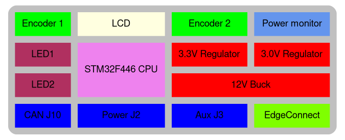
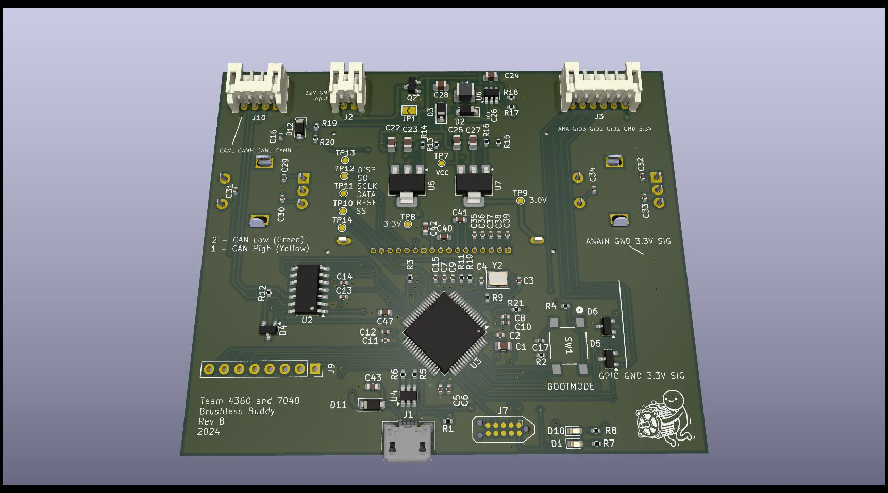

# Brushless Buddy
This is a small PCB with a display and two rotary encoders. The device
is designed to help teams quickly prototype BLC designs using the Rev SparkMax
motor controllers. Although it could be expanded to support other devices.

# Design
The block diagram is shown below. The design consists of an input buck regulator.
The regulator should be good up to 24V, but was designed to work at 12V. There
is reverse battery protection, so it should handle accidentially connecting
the battery up in reverse.

The buck generates 5V which is used for the CAN transceiver. The 5V is fed
to two LDO's to generate 3.3V for the processor and 3.0V for the LCD backlight.

There are two status LEDs on the board, two rotary encoders, and a 128x32 pixel
graphical LCD. An STM32F446 processor powers everything.

There are three user accessible connectors:
Power J2:
| Pin | Use |
| -- | -- |
| 1 | Ground |
| 2 | Power |

The mate is a **JST PHR-2**

CAN J10:
| Pin | Use |
| -- | -- |
| 1 | CAN High |
| 2 | CAN Low |
| 3 | CAN High |
| 4 | CAN Low |

The pinout is the same as the Spark MAX and uses the same connector.
The mate is a **JST PHR-4**

Aux J3:
| Pin | Use |
| -- | -- |
| 1 | 3.3V |
| 2 | Ground |
| 3 | GPIO1 |
| 4 | GPIO2 |
| 5 | GPIO3 |
| 6 | Analog Input |

The mate is a **JST PHR-6**
The auxiliary connector is used for future use cases. It just made sense to
throw this connector on.

The picture below shows the location of the connectors.

# Software
The design runs Micropython. To re-build the code do the following:
1) Download the ARM GCC compiler [GCC](https://developer.arm.com/-/media/Files/downloads/gnu/13.3.rel1/binrel/arm-gnu-toolchain-13.3.rel1-x86_64-arm-none-eabi.tar.xz)
2) Decompress the toolchain to some known location, we will call this *<gcc_emd>*
3) Open a command prompt and update your path: `export PATH=<gcc_emd>/bin:$PATH`
4) Check out this repo, we will call this directory *<repo>*
5) Navigate to *<repo>/software/micropython
6) `make -C mpy-cross -j`
7) `BOARD=FRCMOTOR make -C ports/stm32/ -j`
8) Connect the Tagconnect to the board.
9) Program **firmware.elf** using the STM32CubeProgrammer.

## SWD Debug
1) Run

